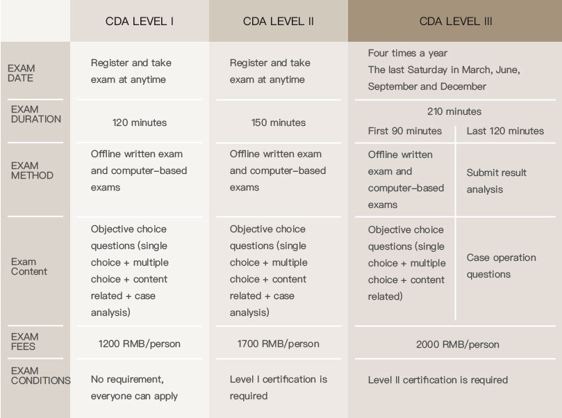
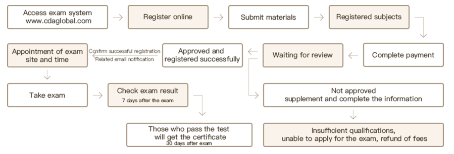

# CDA

Certified Data Analysis 

## Exam Contents

## Exam Date

Level Ⅰ: Take the exam **with your application，After registering and taking the test, candidates can choose their own time within one year and make an appointment for the test at the nearest test center.**
Level Ⅱ: ****Take the exam with the registration，After registering and taking the test, candidates can choose their own time within one year and make an appointment for the test at the nearest test center.****
Level Ⅲ: **Four sessions a year (the last Saturday of March, June, September, and December), and** registration for the session is closed one month before each test

## Registration Process

## LINK

[Offices website](https://www.cdaglobal.com/en/)

https://www.cda.cn/
